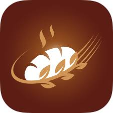
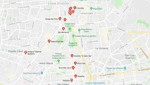
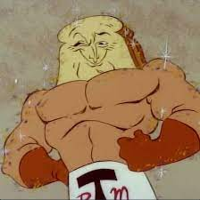

# sjplop.github.io
sjplop
<!DOCTYPE html>
<html lang="en">
<head>
	<body style="background-color: #a05000;">
	</body>
	<body background="pans.gif"></body>
<meta charset="UTF-8"/>
<meta http-equiv="X-UA-Compatible" content="IE=edge"/>
<meta name="viewport" content="width, intial-scale=1.0"/>
<link rel="stylesheet" href="style.css">
<title>Panadería</title>
</head>
<body>

<header> 

<nav class="Header_navbar">
<ul class= "Navbar_list">
<li class="List_item">
	<a href="panm1">Inicio</a>
</li>     
<li class="List_item">
	<a href="https://www.seccionamarilla.com.mx/resultados/panaderias/chihuahua/chihuahua/1">OTRAS TIENDAS</a>
</li>                                   
</ul>
<h2>
contactanos aquí<a href="cont.html">AQU&Iacute;<a/>
</h2>
</nav>
</header>

	<section>
		<article>
			<h1>Panadería zona centro</h1>
			<h1>Fecha de inauguración</h1>
			<small>01-307-2022</small>
			<figure>
				
</article>
</figure>

CONTRATANOS PARA TUS EVENTOS

</article>
<article>
	
Laboramos de lunes a sabado

</article>
</section>
        	<table class="egt">
        		<tr>
        		<td>Bolillo</td>
        		<td>Dona</td>
        		<td>brioche</td>
        		</tr>
        		<tr>
        		<td>$3</td>
        		<td>$6</td>
        		<td>$8</td>
        		</tr>
        	</table>

           -

        	

	<aside class="columna_aside">
		<blockquote>
			
Comentario 1

        </blockquote>
        <blockquote>
        	
Comentario 2

        </blockquote>
        </aside>
        

        

       </li>
   </ul>
</nav>
</header>

    </body>
   </html>
